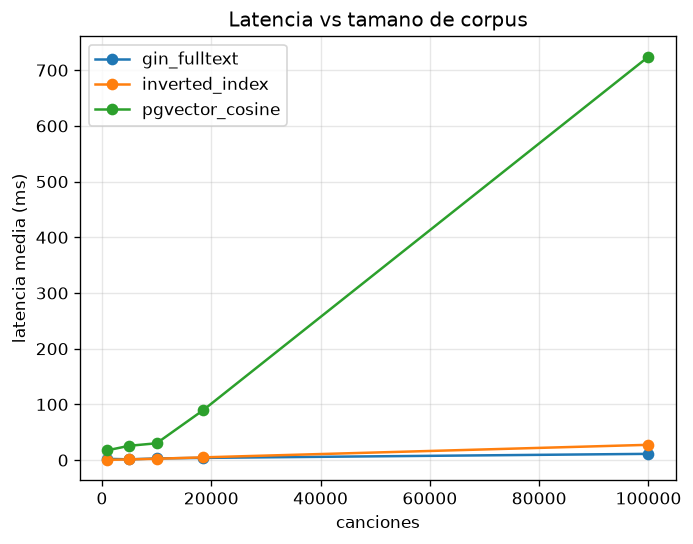
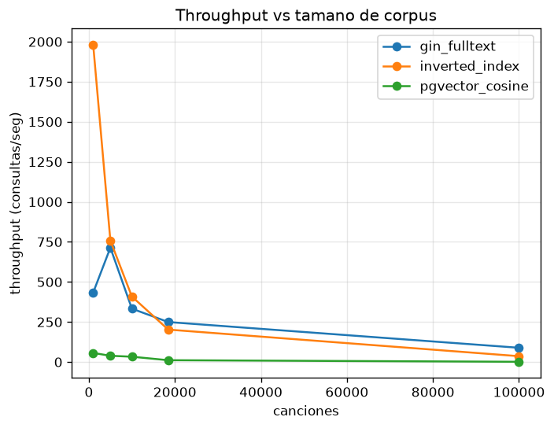
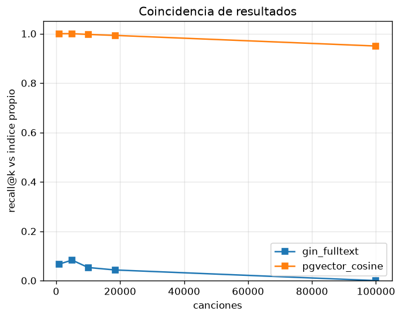
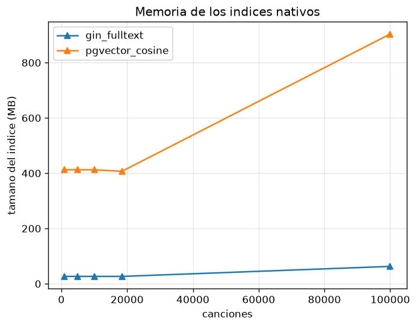
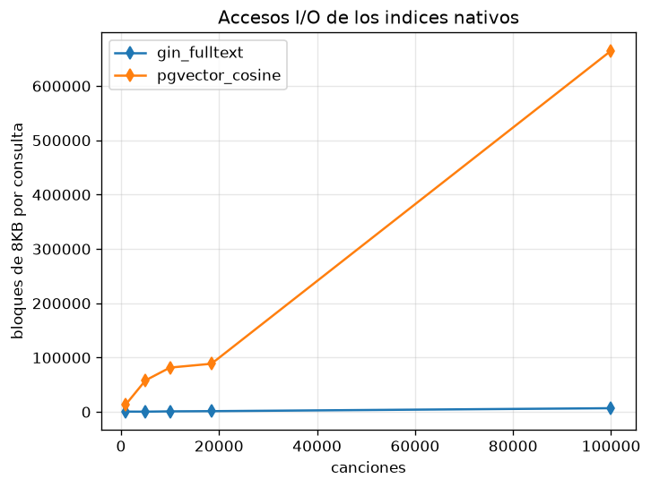
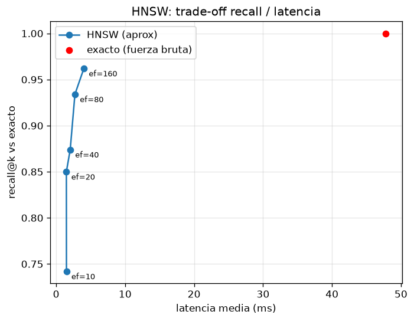
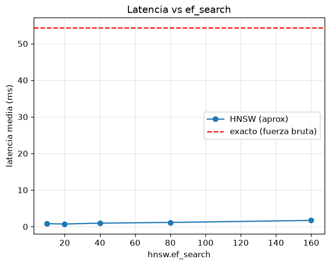

# Sistema Multimodal de Recuperación y Búsqueda

Proyecto 2 — Base de Datos 2 (2026-1). Motor unificado de recuperación que
funciona sobre **texto, imagen y audio** con la misma arquitectura, y que se
compara contra las técnicas nativas de PostgreSQL (GIN full-text y pgvector
con HNSW).

**Apps implementadas:** Búsqueda Visual E-commerce (imagen), Búsqueda Musical
por letra y por similitud acústica (texto + audio, con reproducción de pistas)
y una Consola de consultas multimodal (mini-lenguaje tipo SQL).

El informe técnico completo está en [docs/informe.pdf](docs/informe.pdf)
(fuente en [docs/informe.tex](docs/informe.tex)) y el manual de usuario en
[docs/MANUAL.md](docs/MANUAL.md).

## Arquitectura unificada

La idea central del proyecto: el mismo paradigma sirve para cualquier modalidad,
solo cambian el extractor y el codebook.

```
CONTENIDO → SPLIT (chunks) → EXTRACTOR (features) → CODEBOOK → ÍNDICE INVERTIDO → BÚSQUEDA
```

| Etapa | Texto | Imagen | Audio |
|-------|-------|--------|-------|
| Split | párrafos / estrofas | la imagen del producto | ventanas de 3 s |
| Extractor | tokens (nltk) | SIFT (128-d) + color HSV | MFCC (40-d) |
| Codebook | top-k palabras, k=1024 | K-Means, k=512 (visual words) | K-Means, k=128 (acoustic words) |
| Ponderación | log(1+tf)·idf, normalización L2 | ídem | ídem |
| Índice | SPIMI → índice invertido | el mismo índice | el mismo índice |
| Búsqueda | coseno sobre histogramas | el mismo coseno | el mismo coseno |

El núcleo de búsqueda (`search_sparse`) es **idéntico** para las tres
modalidades: recibe un histograma disperso y no le importa de dónde salió. Eso
es lo que hace la arquitectura "agnóstica".

## Datasets

- **Música (texto):** *Audio features and lyrics of Spotify songs* (Kaggle,
  `imuhammad/...`) — 18.454 canciones con letra, multilingüe (mayoría inglés,
  algo de español). Se usan `track_name`, `track_artist`, `lyrics`.
- **Imagen:** *Fashion Product Images (Small)* (Kaggle, `paramaggarwal/...`) —
  ~44.000 imágenes de productos de moda.
- **Audio:** *GTZAN* (Kaggle, `andradaolteanu/...`) — 1.000 pistas de 30 s en
  10 géneros. Se usan las ventanas de 3 s con 20 MFCC (`features_3_sec.csv`) y
  los `.wav` (`genres_original/`) para reproducir las pistas desde la UI.

El ingest acepta `.csv` / `.json` / `.parquet` y mapea columnas por alias, así
que el dataset es intercambiable.

### Cómo obtener los datos

Los datasets **no están en el repo** (son pesados; van en `.gitignore`). Cada
quien los baja una vez de Kaggle y los deja en `data/raw/`. Necesitas una cuenta
de Kaggle y su CLI (`pip install kaggle` + tu token en `~/.kaggle/kaggle.json`).

```bash
# Música (CSV de letras)
kaggle datasets download -d imuhammad/audio-features-and-lyrics-of-spotify-songs \
  -p data/raw/spotify --unzip

# Imágenes (versión small, ~592 MB)
kaggle datasets download -d paramaggarwal/fashion-product-images-small \
  -p data/raw/fashion --unzip

# Audio GTZAN (~1.3 GB: features CSV + wavs)
kaggle datasets download -d andradaolteanu/gtzan-dataset-music-genre-classification \
  -p data/raw/music --unzip
```

Tras esto debes tener `data/raw/spotify/spotify_songs.csv`, las imágenes en
`data/raw/fashion/images/`, y para audio `data/raw/music/features_3_sec.csv` +
`data/raw/music/genres_original/`. (El zip de GTZAN trae una carpeta `Data/`;
mueve su contenido directo a `data/raw/music/`.) Sin token de Kaggle puedes
bajarlos a mano desde la web del dataset y descomprimirlos en esas mismas
carpetas. Luego corre el ingest (ver más abajo) para construir los índices.

## Implementación por módulo

- **Split** — [paragraph.py](backend/app/engine/split/paragraph.py) parte el
  texto en párrafos (robusto a letras vacías/NaN);
  [audio_window.py](backend/app/engine/split/audio_window.py) arma las ventanas
  de 3 s del CSV de GTZAN.
- **Extractor** — [sift.py](backend/app/engine/extractor/sift.py): SIFT con
  OpenCV (import perezoso) + [color.py](backend/app/engine/extractor/color.py)
  (histograma HSV, porque SIFT no ve el color);
  [mfcc.py](backend/app/engine/extractor/mfcc.py): MFCC desde el CSV o desde un
  audio subido (librosa). Para texto el extractor es la tokenización.
- **Codebook** — [linguistic.py](backend/app/engine/codebook/linguistic.py)
  (top-k con tokenizar/stopwords/stemming) y
  [kmeans.py](backend/app/engine/codebook/kmeans.py) (MiniBatchKMeans → visual /
  acoustic words). Ambos ponderan con TF-IDF sublineal (log(1+tf)·idf) y
  producen histogramas L2-normalizados.
- **Índice invertido** — [spimi.py](backend/app/engine/index/spimi.py)
  (Single-Pass In-Memory Indexing, obligatorio para texto: vuelca bloques a
  disco y hace k-way merge) + [inverted.py](backend/app/engine/index/inverted.py).
- **Búsqueda** — [similarity.py](backend/app/engine/search/similarity.py):
  coseno con accumulator (solo toca los chunks que comparten codewords).
- **Consola multimodal** — [parser.py](backend/app/engine/query/parser.py):
  parser del mini-lenguaje SQL que enruta a la modalidad correcta.
- **Persistencia** — [repository.py](backend/app/db/repository.py): vuelca
  codebook, histogramas, metadatos e índice invertido a PostgreSQL.
- **Comparativas** — [comparisons/](backend/app/comparisons/): la misma consulta
  por todos los enfoques (índice propio, GIN, pgvector exacto y HNSW).

## Resultados experimentales

Benchmark de texto sobre datos reales (Spotify), cargas de
1K/5K/10K/18.454/**100K** canciones (la de 100K recicla el corpus, como pide
el enunciado: pequeña 1K, mediana 10K, grande 100K), 30 consultas cada una,
codebook k=1024. Generado con
[experiments/benchmark.py](backend/experiments/benchmark.py).

La columna **I/O** son los accesos por consulta: bloques de 8KB tocados según
`EXPLAIN (ANALYZE, BUFFERS)` para los nativos; para el índice propio (que vive
en RAM) el equivalente son los postings que recorre el accumulator.

Corpus real completo (18.454 canciones):

| Enfoque | Latencia media | p95 | Throughput | Recall@10 | I/O por consulta |
|---------|---------------:|----:|-----------:|----------:|-----------------:|
| Índice invertido (propio) | 4.9 ms | 7.8 ms | 202 q/s | 1.00 (ref.) | 7.6K postings |
| GIN full-text | **4.0 ms** | 13.0 ms | **250 q/s** | 0.04 | 1.4K bloques |
| pgvector coseno (exacto) | 89.2 ms | 101.7 ms | 11 q/s | **0.99** | 88.7K bloques |

Carga grande (100.000 canciones):

| Enfoque | Latencia media | p95 | Throughput | Recall@10 | I/O por consulta |
|---------|---------------:|----:|-----------:|----------:|-----------------:|
| Índice invertido (propio) | 27.5 ms | 48.4 ms | 36 q/s | 1.00 (ref.) | 40.8K postings |
| GIN full-text | **11.2 ms** | 41.0 ms | **89 q/s** | 0.00* | **6.8K bloques** |
| pgvector coseno (exacto) | 724 ms | 1036 ms | 1.4 q/s | 0.95 | 665K bloques (~5 GB) |

\* con el corpus reciclado hay duplicados que empatan en `ts_rank` y hacen el
top-10 de GIN arbitrario; su recall contra el coseno ya era ~0.04 sin duplicados.







### ANN: HNSW vs búsqueda exacta

Con el índice HNSW creado sobre los histogramas (dimensiones acopladas al k de
cada codebook: texto 1024, imagen 544, audio 128), medimos el trade-off
recall/latencia barriendo `hnsw.ef_search`. Generado con
[experiments/ann_benchmark.py](backend/experiments/ann_benchmark.py).

| Método | ef_search | Latencia media | QPS | Recall@10 |
|--------|----------:|---------------:|----:|----------:|
| pgvector exacto (Seq Scan) | — | 47.8 ms | 21 | 1.00 |
| pgvector HNSW | 10 | 1.5 ms | 670 | 0.74 |
| pgvector HNSW | 160 | 4.0 ms | 249 | 0.96 |




### Análisis y trade-offs

- **Latencia / throughput:** el índice invertido propio gana hasta ~10K chunks;
  en el corpus completo GIN lo empata y en 100K lo supera (11 vs 27 ms): sus
  posting lists comprimidas escalan mejor que las del índice en RAM, que crecen
  de 889K a 4.8M postings. pgvector exacto colapsa en la carga grande (724 ms).
  HNSW acelera la búsqueda vectorial 12–32× frente al escaneo exacto.
- **Recall:** pgvector recupera lo mismo que el motor propio (recall ≥0.95,
  exacto hasta 10K; en audio hasta con los mismos scores), lógico porque ambos
  hacen coseno sobre los mismos histogramas TF-IDF. GIN recupera un conjunto
  distinto (recall ~0.04): hace match booleano de términos + `ts_rank`, no
  similitud de histograma. No es "peor", es otra semántica.
- **I/O (la métrica que explica todo):** por consulta, pgvector exacto lee la
  tabla completa de histogramas (665K bloques ≈ 5 GB en 100K), GIN solo las
  posting lists de los términos (1.4–6.8K bloques), y el propio ni toca disco
  (recorre 0.4–41K postings en RAM). El orden de las latencias es exactamente
  el orden de la E/S.
- **Memoria:** GIN va de ~27 a ~63 MB; la tabla de histogramas llega a ~0.9 GB
  en la carga de 100K. *Nota:* `histograms` guarda las tres modalidades, así
  que su tamaño es una cota superior para el texto.

**Conclusión:** para búsqueda por similitud, el índice invertido + codebook es
el motor primario (rápido y compacto); pgvector+HNSW es la vía nativa cuando se
quiere delegar la búsqueda vectorial a la base (sacrificando algo de recall);
GIN sirve para full-text clásico por palabras clave.

## Instalación y uso

Requisitos: Docker. La base trae PostgreSQL + pgvector y los scripts de init
(schema + índices GIN y HNSW).

```bash
docker compose up --build        # db (5432) + backend (8000) + frontend (5173)
```

Cargar datos y persistir en Postgres (dentro del contenedor backend):

```bash
# música (texto, k=1024)
docker compose exec backend python -m pipelines.ingest \
  --app music --data /data/raw/spotify/spotify_songs.csv --k 1024 --persist

# e-commerce (imagen, k=512 + color)
docker compose exec backend python -m pipelines.ingest \
  --app ecommerce --modality image --data /data/raw/fashion/images --k 512 --persist

# música (audio, k=128)
docker compose exec backend python -m pipelines.ingest \
  --app music --modality audio --data /data/raw/music/features_3_sec.csv --k 128 --persist
```

> Ojo: las dimensiones de los índices HNSW en
> [01_init.sql](db/init/01_init.sql) están acopladas al `--k` del ingest
> (texto 1024, imagen 512+32 de color = 544, audio 128). Si cambias un `k`,
> actualiza el índice correspondiente.

- UI: http://localhost:5173 — pestañas para las apps + consola de consultas.
- API docs: http://localhost:8000/docs
- Comparativas en vivo: `GET /compare/text?q=...`,
  `GET /compare/vector?external_id=...`, `GET /compare/audio?filename=...` —
  cada una devuelve los enfoques con su latencia.

Benchmarks de la Fase 4 (generan CSV + gráficos en `experiments/results/`):

```bash
# comparativa de texto por tamaño de corpus (1K a 100K, con métrica de I/O)
docker compose exec backend python -m experiments.benchmark \
  --data /data/raw/spotify/spotify_songs.csv --sizes 1000 5000 10000 18454 100000

# HNSW vs búsqueda exacta
docker compose exec backend python -m experiments.ann_benchmark
```

## Tests

```bash
cd backend && pytest          # 34 tests; los de Postgres se saltan si no hay DB
```

Para correr los tests de Postgres sin tocar tus datos, apúntalos a una base
desechable con `TEST_DATABASE_URL` (los tests hacen reset de su modalidad).

## Estructura

```
backend/
  app/
    api/          routers: ecommerce, music, compare, query
    engine/       arquitectura unificada
      split/        párrafos / ventanas de audio
      extractor/    sift, color hsv, mfcc
      codebook/     lingüístico y k-means (tf-idf sublineal)
      index/        spimi, índice invertido, histogramas
      search/       búsqueda coseno compartida
      query/        parser del mini-lenguaje multimodal
    apps/         orquestadores por app (text_index, visual_index, acoustic_index)
    db/           sesión, repositorio y adaptadores de persistencia
    comparisons/  propio vs GIN vs pgvector (text, image, audio, ann)
    core/         config
  pipelines/      ingest offline (+ --persist a Postgres)
  experiments/    benchmarks Fase 4 + resultados (CSV y gráficos)
frontend/         UI React + Vite (pestañas de las apps + consola)
db/init/          01_init.sql (pgvector + schema + índices GIN/HNSW)
docs/             informe técnico (tex/pdf) + manual de usuario
docker-compose.yml
```
